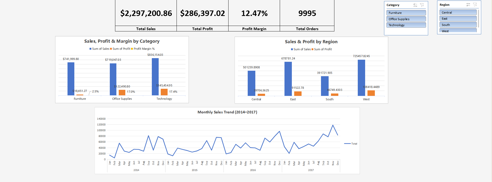

# Superstore Sales & Profitability Dashboard (Excel)

An interactive Excel dashboard analyzing 4 years of retail transaction data to uncover where sales are strong but profitability is weak — built entirely with native Excel tools (PivotTables, PivotCharts, Slicers, calculated fields) with no external BI software.

---

## Project Goal

High sales don't always mean high profit. This project analyzes ~10,000 Superstore transactions (2014–2017) to answer a core business question:

> **Which categories and regions are actually profitable, not just high-revenue — and how does performance change over time?**

---

## Dashboard



**KPI Cards:** Total Sales, Total Profit, overall Profit Margin, and Total Orders — the headline numbers at a glance.

**Sales, Profit & Margin by Category:** Compares revenue against actual profitability per category, not just volume.

**Sales & Profit by Region:** Breaks down performance across Central, East, South, and West.

**Monthly Sales Trend (2014–2017):** A line chart revealing seasonal demand patterns across four years.

**Interactive Slicers:** Region and Category slicers are connected to every PivotTable/Chart on the dashboard, so any view can be filtered instantly.

---

## Key Findings

- **Furniture generates nearly as much revenue as Technology ($742K vs. $836K) but converts almost none of it to profit** — a 2.5% margin versus 17%+ for Office Supplies and Technology. High sales volume alone is a misleading success metric here.
- **West and East regions lead in both sales and profit**, while **South lags in sales volume and Central lags in profit margin** — the two weak spots aren't the same region, which matters for where a business would intervene.
- **Sales show a clear, recurring seasonal pattern** — September and November consistently outperform other months across all four years, alongside steady year-over-year growth.

---

## Tech Stack

- **Excel** — PivotTables, PivotCharts, Slicers, Calculated Fields, Excel Tables

---

## Key Calculated Field

```
Profit Margin = Profit / Sales
```

Added as an Excel PivotTable Calculated Field so it recalculates automatically whenever the Region/Category slicers filter the underlying PivotTables — no manual recalculation needed.

---

## Dataset

[Superstore Dataset (Kaggle)](https://www.kaggle.com/datasets/vivek468/superstore-dataset-final) — ~10,000 retail order records including sales, profit, discount, region, category, and order dates from 2014–2017.

---

## About

Built to demonstrate core Data Analyst deliverables using native Excel — PivotTable-driven KPIs, an interactive slicer-linked dashboard, and business-oriented findings (margin vs. volume, regional gaps, seasonality) rather than just descriptive charts.
